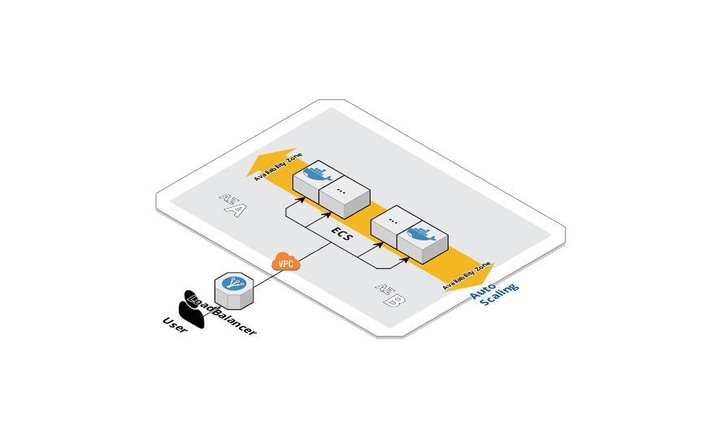

# Theorem-SRE-Task
Theorem LLC - DevOps Prototyping Exercise. This Document specify in 4 parts, all the resources needed to complete the Theorem-SRE-Task assigned:

### 1. Application.

I used golang to create a simple application exposing an HTTP API with 2 endpoints:
  -  (/) Endpoint 1: Json payload response
  -  (/health) Endpoint 2: used for healthcheck

The application will run/listen on port: 8080, the application can be found inside /src folder.

### 2. Containerization.

A multi stage Dockerfile was created, the document is divided in two, the first part include the building steps and the second part the final stage with the minimal size base image. Multi-stage builds are a new feature requiring Docker 17.05 or higher on the daemon and client. Multistage builds are useful to anyone who has struggled to optimize Dockerfiles while keeping them easy to read and maintain.

### 3. Infrastructure. (AWS)  

For simplicity I decided to use cloudformation for the IaC. It can also be done with other tool like Ansible or Terraform, but this implies more setup time, for the terraform and Ansible users policies and I prefer to dedicate more time to deeply explain the 4 points needed for the task.

Later in the document you will see a real IaC CI/CD implementation for the infra and the application code, using codepipeline.

####   - VPC.

I started with the VPC/Network setup, it includes 2 Subnets in different Availability zones for High Availability, can be extended to more Subnets if needed.

I created a VPC, and specified a range of IPv4 addresses for the VPC in the form of a Classless Inter-Domain Routing (CIDR) block; for example, 10.20.0.0/16. This is the primary CIDR block for your VPC.

A VPC spans all the Availability Zones in the region. After creating a VPC, you can add one or more subnets in each Availability Zone. In our case I created 2. When I created a subnet, I specified the CIDR block for the subnet, which is a subset of the VPC CIDR block. Each subnet must reside entirely within one Availability Zone and cannot span zones. Availability Zones are distinct locations that are engineered to be isolated from failures in other Availability Zones. By launching instances in separate Availability Zones, you can protect your applications from the failure of a single location.

There is also a setup for the Internet gateway and the needed routing table to get access from and to the Internet. An internet gateway enables communication over the internet.

Each subnet must be associated with a route table, which specifies the allowed routes for outbound traffic leaving the subnet. Every subnet that you create is automatically associated with the main route table for the VPC.

AWS provides two features that I can use to increase security in the VPC created: security groups and network ACLs. Security groups control inbound and outbound traffic for the instances, and network ACLs control inbound and outbound traffic for our subnets. Security groups are enough for my actual needs in this exercise.

As outputs I setup, the Azs, the Subnets, the VPC Id and the VPC DefaultSG, all this with the idea to create a Cloudformation Nested Stack.

####   - Loadbalancer.

In the loadbalancer yaml file I added the Loadbalancer definition, the healthcheck setup (path and httpcode expected) used during the Blue-green deployment, the Security Group and the cookie stickiness in case a cookies auth is needed.

Each target group is used to route requests to one or more registered targets. When I created the listener rule, I specify a target group and condition (/). When a rule condition is met, traffic is forwarded to the corresponding target group. I defined the health check settings of the load balancer on a per target group basis.

After I specify a target group in a rule for a listener, the load balancer continually monitors the health of all targets registered with the target group that are in an Availability Zones enabled for the load balancer. The load balancer routes requests to the registered targets that are healthy.

As output I added the Loadbalancer Targetgroup, the Security Group created and the Url where the service is going to be ready.

####   - ECS Cluster.

An Amazon ECS cluster is a logical grouping of tasks or services. If you are running tasks or services that use the EC2 launch type, a cluster is also a grouping of container instances. 

The Amazon ECS–optimized Amazon Machine Image (AMI) comes prepackaged with the Amazon Elastic Container Service (ECS) container agent, Docker, and the ecs-init service. When updates to these components are released, try to integrate them as quickly as possible. Doing so helps you maintain a safe, secure, and reliable environment for running your containers.

Each release of the ECS–optimized AMI includes bug fixes and feature updates. AWS recommends refreshing your container instance fleet with the latest AMI whenever possible, rather than trying to patch instances in-place. Periodical replacement of your ECS instances aligns with the immutable infrastructure paradigm, which is less prone to human error. It’s also less susceptible to configuration drift because infrastructure is managed through code.

I created the ECS role and the Security Group for the ECS Cluster, Allowing access for the Loadbalancer Security Group, There is also an autoscaling group definition based on the CPU resources consumption to scale up and down. 

A launch configuration is created as an instance configuration template that an Auto Scaling group uses to launch our EC2 instances during the scaling. I specified the needed information for the instances. Including the ID of the Amazon Machine Image (AMI), the instance type, a key pair for future SSH access, the security groups, and a block device mapping.

With a simple and step scaling policies in the file, I choose scaling metrics and threshold values for the CloudWatch alarms that trigger the scaling process based on CPU usage. I also define how the Auto Scaling group should be scaled when a threshold is in breach for the specified number of evaluation periods, 2 evaluation periods, with 5 minutes.

As output of the yaml file I added The cluster name from the cluster generated.

####   - Service.

The service resource creates an Amazon Elastic Container Service (Amazon ECS) service that runs and maintains the requested number of tasks and associated load balancers. Amazon ECS allows you to run and maintain a specified number of instances of a task definition simultaneously in an Amazon ECS cluster.  This is called a service. 

I created a ECR Repository in this yaml file, an Amazon Elastic Container Registry (Amazon ECR) provides API operations to create, monitor, and delete image repositories and set permissions that control who can access them. 

Besides the ECR and the service a task definition is needed, A task definition is required to run Docker containers in Amazon ECS. Some of the parameters you can specify in a task definition include:

 - The Docker image to use with each container

 - How much CPU and memory to use with each task or each container within a task

 - The launch type to use, which determines the infrastructure on which the tasks are hosted

 - The Docker networking mode to use for the containers in the task

 - The logging configuration to use for the tasks

 - Whether the task should continue to run if the container finishes or fails

 - The command the container should run when it is started

 - The IAM role that the tasks should use
 
I want the task placement strategy to be spreaded into all the instances. Thats why I use the spread placement strategy. the Placed tasks are evenly based on the specified value.

### 4. Application Codepipeline.

Defined also as Infrastructure, the pipeline specify 3 stages:

- Source: The codepipeline will start with a change everytime a change is submited to the Mater Branch in the Github Repository

- Build: A codebuild project is created, this will build the Docker image and push it to the ECR repository.

- Deploy: Takes the images from the ECR and using the Loadbalancer Health check is able to Deploy using a Blue Green Deployment. Once the new version is ready and response with a 200 code to the LoadBalancer this will be the actual version .deployed and will delete the old version.

### 5. Special Considerations:
1.- During the cloudformation launch, please be careful with the parameter KeyPairName, this one specify the name of a public key and it needs to be present in your AWS account.

2.- To demonstrate the use of SSM parameters for secrets variables there is a parameter called /infra/github/GitHubToken, this one keep the value for the Github Token: XXXXXXXXX this value needs to be set before the stack creation, you can use the CLI command https://docs.aws.amazon.com/cli/latest/reference/ssm/put-parameter.html or using your aws web console, System Manager -> Parameter Store -> Create Parameter. https://console.aws.amazon.com/systems-manager/parameters?region=us-east-1 (Please ask me on slack about the Github Token Value.)

3.- The Launch Stack Button in the Infrastruacture section title, will open the AWS Cloudformation service with the Main Launcher and default values already loaded. This was tested on us-east-1 (North Virginia) region. Please be careful with the special considerations 1 and 2 before launching the stack.

4.- From the Main Stack Output you will find the Service URL, should be somethig similar to this one: http://theor-loadb-r82dk4pi1aau-1239792048.us-east-1.elb.amazonaws.com/ there is 2 endpoints, the root will show the json response and /heatlh is used for healthcheck during the Blue Green Deployment

5.- The Codepipeline url is an output from the Codepipeline Stack, the url should be similar to: https://console.aws.amazon.com/codesuite/codepipeline/pipelines/Theorem-task-Code-CP/view?region=us-east-1

6.- The image used by the Codebuild is the Docker:18.09.0 is the one supporintg multi phases Dockerfile.

7.- Regarding the requirements:

  a)It must run as a container.: It use Docker as container and ECS as a Container Orchestrator.
  
  b)It must have an automated deployment strategy. It implements a Blue Green Deployment using a Codepipeine and Github hook with the master Branch.
  
  c)It must be deployed on AWS, Azure, or GCP. The resources you create must originate from code. Its deploy to AWS and the IaC was made with Cloudformation yaml. Following the Launch Stack button will create all the resources with default values.
  
  d)The application must be able to autoscale. It implements scalability based on resources consumption (CPU) and cloudwatch alarms. Also implements High Avilability deploying to multiple AWS Availability zones.

### 6. Architecture Diagram

